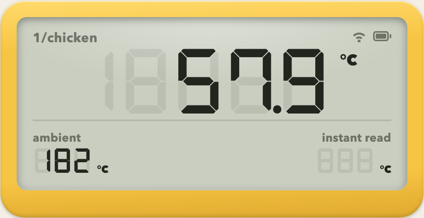
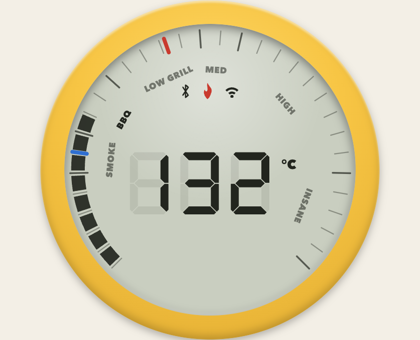
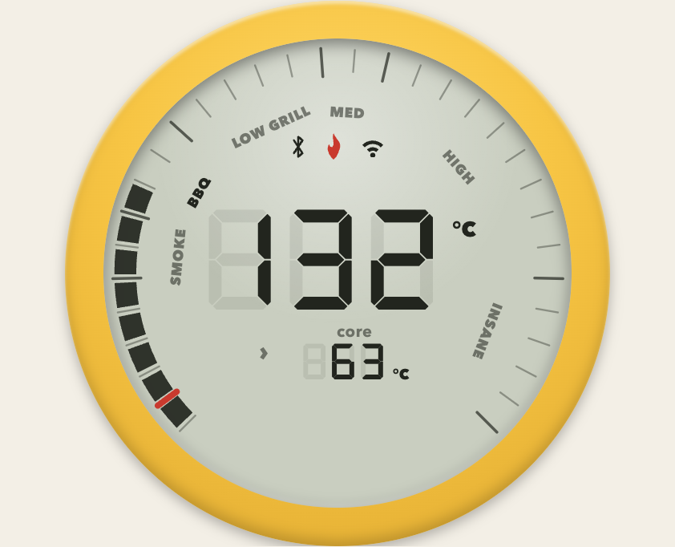

# 🔥 Combustion BLE Integration

Integrate [Combustion](https://combustion.inc) predictive probes and gauges into Home Assistant.

[![GitHub Release][releases-shield]][releases]
[![License][license-shield]](LICENSE)
![Project Maintenance][maintenance-shield]

> **Note:** This is a maintained fork of [legrego/homeassistant-combustion](https://github.com/legrego/homeassistant-combustion) with fixes for Home Assistant 2026.3+ and additional device support. See [What's different in this fork](#whats-different-in-this-fork).

<p align="center">
  
</p>

**This integration will set up the following platforms.**

Platform | Description
-- | --
`binary_sensor` | Battery, overheating, cooking / probe-inserted (probes) and sensor-connected / alarm status (gauges).
`sensor` | Temperature data from probes and gauges on your Meatnet, the gauge cooking zone, plus diagnostics (mode, RSSI).

## What's different in this fork

Fixes:

- **Works on Home Assistant 2026.3+ / Python 3.14** — removed the `bitstring` dependency that failed to install (upstream [#108](https://github.com/legrego/homeassistant-combustion/issues/108)).
- **Works with passive Bluetooth proxies** (e.g. Shelly devices) — non-connectable advertisements are now matched.
- **Fixes the crash that could freeze Home Assistant** when a probe was detected (upstream [#68](https://github.com/legrego/homeassistant-combustion/issues/68)): crash-proof advertisement parsing, entity listener lifecycle cleanup, throttled state updates and reduced recorder churn.
- **Entities become unavailable when a device stops advertising** instead of retaining stale values forever (upstream [#44](https://github.com/legrego/homeassistant-combustion/issues/44)).
- Booster / Display advertisements no longer generate errors; hop count parsed per spec; direct probe data preferred over Meatnet-repeated copies.

New features:

- **Giant Grill Gauge support**: temperature, cooking zone (SMOKE…INSANE), sensor-connected, overheating, low-battery and high/low alarm entities.
- **Bundled dashboard card** styled after the Combustion hardware — probes render as the square WiFi Display, the Grill Gauge as its round dial. See [Dashboard card](#dashboard-card).
- **Instant Read temperature sensor** — quick-read temperatures now reach Home Assistant.
- **Probe diagnostics**: mode sensor (normal / instant read / error) with probe ID and ring colour, and a per-probe overheating sensor.

## Installation

### HACS (recommended)

1. In HACS, open the three-dot menu and choose **Custom repositories**.
1. Add `https://github.com/raww/homeassistant-combustion` with category **Integration**.
1. Install **Combustion** from HACS.
1. Restart Home Assistant.
1. Ensure you have a Combustion device turned on and within Bluetooth range of Home Assistant (or a Bluetooth proxy).
1. In the HA UI go to "Configuration" -> "Integrations" to see your discovered Combustion device.

### Manual

1. Using the tool of choice open the directory (folder) for your HA configuration (where you find `configuration.yaml`).
1. If you do not have a `custom_components` directory (folder) there, you need to create it.
1. In the `custom_components` directory (folder) create a new folder called `combustion`.
1. Download _all_ the files from the `custom_components/combustion/` directory (folder) in this repository.
1. Place the files you downloaded in the new directory (folder) you created.
1. Restart Home Assistant
1. Ensure you have a Combustion device turned on, and within bluetooth range of Home Assistant.
1. In the HA UI go to "Configuration" -> "Integrations" to see your discovered Combustion device.

## Configuration

There is currently no configuration required for this integration. Once the integration discovers your Combustion device(s), it will prompt you to add them on the Integrations page.

Optional settings live under **Settings → Devices & Services → Combustion → Configure**: the availability timeout (how long a device may stay silent before its entities become unavailable) and the per-device update throttle.

## Dashboard card

The integration bundles a Lovelace card styled after the Combustion hardware. Probes render as the square 2nd-gen WiFi Display; the Giant Grill Gauge renders as its round dial with the SMOKE→INSANE ring. It registers itself automatically; no resource setup needed. Tap the LCD to open the temperature's details, including Home Assistant's built-in history graph.

| Giant Grill Gauge | Combined pit + food | Probe, mid-cook |
| :---: | :---: | :---: |
|  |  |  |

```yaml
type: custom:combustion-card
serial: 10007dc0        # probe serial — or a gauge serial like G000000123
name: brisket           # optional label, shown as "1/brisket" on the LCD
```

Instead of `serial` you can point it at any entity of the device:

```yaml
type: custom:combustion-card
entity: sensor.predictive_thermometer_10007dc0_core_temperature
```

Probes show core temperature with ambient and instant-read sub-panels plus cooking / probe-in / battery chips.

Gauges render as the round dial: the grill temperature fills the SMOKE→INSANE ring, with red/blue marks for the high/low alarm setpoints. Extra gauge options:

```yaml
type: custom:combustion-card
serial: G000000123
style: square           # optional — use the square face instead of the dial
secondary: 10007dc0     # optional — show a food probe below the grill temp;
                        #   a probe serial cycles core/surface/ambient (tap ›)
```

## Supported devices

This integration supports reading temperature and battery data from Combustion's [Predictive Thermometer](https://combustion.inc/products/predictive-thermometer) and temperature, alarm and status data from the Giant Grill Gauge.

This integration can read data from a probe directly, or via a Meatnet repeater such as the [Range-Extending Booster](https://combustion.inc/products/long-range-predictive-thermometer) or [Range-Extending Display](https://combustion.inc/products/range-extending-display). Advertisements received through Home Assistant Bluetooth proxies (active or passive) are supported.

This integration will not display information about the repeater itself, only the probes connected to it.

## Contributions are welcome!

If you want to contribute to this please read the [Contribution guidelines](CONTRIBUTING.md)

## Credits

[Larry Gregory (@legrego)](https://github.com/legrego) for the original integration this fork is based on.

Combustion, Inc. for their wonderful [documentation](https://github.com/combustion-inc/combustion-documentation) and [code samples](https://github.com/combustion-inc/combustion-ios-ble).


***

[combustion]: https://combustion.inc/
[license-shield]: https://img.shields.io/github/license/raww/homeassistant-combustion.svg?style=flat
[maintenance-shield]: https://img.shields.io/badge/maintainer-raww-blue.svg?style=flat
[releases-shield]: https://img.shields.io/github/release/raww/homeassistant-combustion.svg?style=flat
[releases]: https://github.com/raww/homeassistant-combustion/releases
